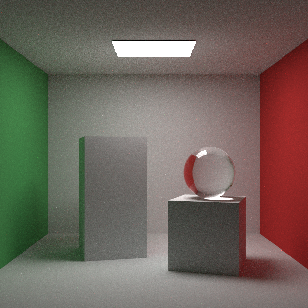

# rt-go

rt-go is a small path tracer written in Go. Scenes are described with JSON and
can contain spheres, boxes, quads, triangles, OBJ meshes, matte/metal/glass
materials, and emissive lights.




## Features

Rendering basics:

- CPU path tracing
- Antialiasing
- Gamma correction
- Cosine-weighted diffuse sampling
- Mixture PDFs for combining material and light sampling
- Direct light sampling
- Configurable image size, samples, max depth, camera, and output path
- PPM image output with live scanline updates

Scene objects:

- Spheres
- Quads
- Boxes
- Triangles
- Triangle meshes
- OBJ model loading
- MTL material loading
- Smooth OBJ normals

Materials and lights:

- Lambertian matte materials
- Texture support: solid
- Metal materials
- Dielectric glass materials
- Diffuse light materials
- One-sided emissive lights
- Weighted sampling targets

Transforms:

- Translation
- Rotation

Performance:

- Parallel scanline rendering
- BVH acceleration

Tools:

- JSON scene files
- Simple browser viewer

## Usage

Place an OBJ model in:

```text
models/figurine.obj
```

If the model has a material file, place it in the same folder and make sure the OBJ points to it with `mtllib`.

Render a JSON scene:

```sh
go run . -r examples/gallery.json
```

This writes:

```text
image.ppm
```

Edit a JSON scene file to change the camera, render quality, objects,
materials, and lights.

Other example scenes are in `examples/`.

See [sceneGuide.md](sceneGuide.md) for a guide on how to design a scene.

For the browser viewer:

```sh
go run . -v examples/gallery.json
```

Then open:

```text
http://localhost:8080
```

## Notes

Large OBJ files can take time to load because the renderer parses the mesh and builds a BVH before rendering.

Scenes are defined with JSON files in `examples/`.

Increase `render.samples` in a JSON scene file for a cleaner image. Higher sample counts reduce noise but take more time to render.
